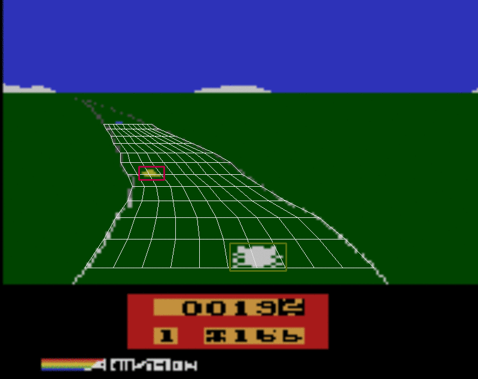

# Reinforcement Learning with Function Approaximation

We built an LFA agent for playing enduro games. Enduro is an old racing game published by Activision for Atari 2600.

## Brief Description

The agent gets rewards if it overtakes the other cars, but gets negative rewards if it is overtaken. The car will suddenly decelerate if it hits another car.

The features we built are to stay in the center of the road, to keep accelerating, and to avoid collision by braking or turning left/right. The Q(s,a) state-action value function consists of parameters vector and features vector. This parameters vector is updated using off-policy TD update rule.

### The Gameplay




## Installation

```
sudo apt-get install build-essential cmake pkg-config git
sudo apt-get install libjpeg8-dev libtiff5-dev libjasper-dev libpng12-dev
sudo apt-get install libavcodec-dev libavformat-dev libswscale-dev libv4l-dev
sudo apt-get install libxvidcore-dev libx264-dev
sudo apt-get install libgtk-3-dev
sudo apt-get install libatlas-base-dev gfortran
conda install numpy

cd ~
conda install -c conda-forge opencv

cd ~
sudo apt-get install libsdl1.2-dev libsdl-gfx1.2-dev libsdl-image1.2-dev
git clone https://github.com/mgbellemare/Arcade-Learning-Environment.git
cd Arcade-Learning-Environment/
mkdir build
cd build/
cmake -DUSE_SDL=ON -DUSE_RLGLUE=OFF -DBUILD_EXAMPLES=ON ..
make -j4
cd ..
pip install .

cd ~
git clone https://github.com/ridlonurrahman/<this-repo>.git
```
Full instalation, please see [this](https://github.com/ipab-rad/rl-cw1).

## References

[RL-CW1](https://github.com/ipab-rad/rl-cw1) - This project is the final coursework of RL 2016/2017 course at School of Informatics, University of Edinburgh

[Model Free Control](http://www0.cs.ucl.ac.uk/staff/d.silver/web/Teaching.html) - RL course by David Silver, the best RL course out there
